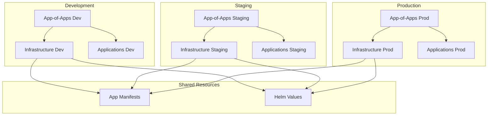

# Skynet Kubernetes Manifests

Central GitOps repository implementing environment-based deployment pattern for managing all Kubernetes applications and infrastructure components via Argo CD.

## 🏗️ Repository Structure

```
skynet-kubernetes-manifests/
├── argocd-manifests/              # Environment-specific ArgoCD applications
│   ├── dev/                       # Development environment
│   │   ├── app-of-apps.yaml       # Root application for dev
│   │   ├── argocd-projects.yaml   # ArgoCD projects configuration
│   │   ├── ingress-nginx.yaml     # Ingress controller for dev
│   │   ├── observability-stack.yaml
│   │   ├── skynet-docs.yaml       # Documentation application
│   │   └── workload-namespaces.yaml
│   ├── staging/                   # Staging environment
│   │   └── ... (same structure as dev)
│   └── prod/                      # Production environment
│       └── ... (same structure as dev)
├── app-manifests/                 # Raw Kubernetes manifests
│   ├── argocd/                    # ArgoCD configuration
│   ├── observability-stack/      # Monitoring and observability
│   └── workload-namespaces/       # Application namespaces
├── helm-values/                   # Helm chart values by environment
│   ├── ingress-nginx/
│   │   ├── values-dev.yaml
│   │   ├── values-staging.yaml
│   │   └── values-prod.yaml
│   ├── observability-stack/
│   └── workload-namespaces/
├── test-structure.sh              # Validation script
└── README.md
```

## 🔄 GitOps Workflow

### Environment-Based Pattern

This repository implements an **environment-based GitOps pattern** where:

1. **Environment Separation**: Each environment (dev/staging/prod) has its own ArgoCD applications
2. **App-of-Apps per Environment**: Each environment has its own root application
3. **Shared Manifests**: Common Kubernetes manifests are stored in `app-manifests/`
4. **Environment-Specific Values**: Helm values are separated by environment in `helm-values/`

### Deployment Flow



## 🚀 Getting Started

### 1. Deploy Environment-Specific App of Apps

Choose your target environment and deploy the corresponding app-of-apps:

**Development:**

```bash
kubectl apply -f argocd-manifests/dev/app-of-apps.yaml
```

**Staging:**

```bash
kubectl apply -f argocd-manifests/staging/app-of-apps.yaml
```

**Production:**

```bash
kubectl apply -f argocd-manifests/prod/app-of-apps.yaml
```

### 2. Verify Deployment

Check that all applications are synchronized:

```bash
# Check application status
kubectl get applications -n argocd

# Monitor sync status
argocd app list

# View specific application
argocd app get app-of-apps-dev
```

## 🧪 Testing

Run the comprehensive test suite:

```bash
./test-structure.sh
```

This script validates:

- ✅ YAML syntax across all files
- ✅ Kubernetes resource validation
- ✅ Helm template rendering
- ✅ Directory structure consistency
- ✅ Environment consistency
- ✅ Git repository status

## 🔄 Migration from App-of-Apps Pattern

This repository has been refactored from the traditional App-of-Apps pattern to an environment-based approach for:

- **Better Environment Isolation**: Each environment is completely independent
- **Easier Rollbacks**: Environment-specific rollbacks without affecting others
- **Clearer Separation**: Environment-specific configurations are explicit
- **Scalable Growth**: Easy to add new environments (e.g., qa, uat)

## �️ Environment Differences

| Feature | Development | Staging | Production |
|---------|-------------|---------|------------|
| Service Type | NodePort | LoadBalancer | LoadBalancer |
| Resource Limits | Low | Medium | High |
| Autoscaling | Disabled | Disabled | Enabled |
| Monitoring Retention | 7 days | 30 days | 90 days |
| Backup Strategy | None | Weekly | Daily |

## 🤝 Contributing

1. Create a feature branch from `main`
2. Make your changes
3. Run `./test-structure.sh` to validate
4. Submit a pull request

Apply the root application to Argo CD:

```bash
kubectl apply -f apps/app-of-apps.yaml
```

### 2. Verify Deployment

Check that all applications are synced:

```bash
argocd app list
argocd app get app-of-apps
```

### 3. Access Applications

Once deployed, applications will be available according to their ingress configuration.

## 🔧 Adding New Applications

### 1. Create Application Manifest

Add a new file in `apps/applications/`:

```yaml
apiVersion: argoproj.io/v1alpha1
kind: Application
metadata:
  name: my-new-app
  namespace: argocd
spec:
  project: applications
  source:
    repoURL: https://github.com/cyberdine-skynet/my-new-app
    targetRevision: main
    path: k8s
  destination:
    server: https://kubernetes.default.svc
    namespace: my-new-app
  syncPolicy:
    automated:
      prune: true
      selfHeal: true
    syncOptions:
      - CreateNamespace=true
```

### 2. Commit and Push

```bash
git add apps/applications/my-new-app.yaml
git commit -m "feat: add my-new-app application"
git push origin main
```

The app of apps will automatically detect and deploy the new application.

## 🛡️ Security & RBAC

### Projects

Applications are organized into projects for:
- **Resource isolation**
- **RBAC policies**
- **Source repository restrictions**
- **Destination cluster/namespace restrictions**

### Best Practices

- Use separate projects for infrastructure vs applications
- Implement least-privilege RBAC
- Restrict source repositories per project
- Use namespace isolation

## 📊 Monitoring

Monitor GitOps health through:
- **Argo CD UI**: Visual application status
- **Prometheus Metrics**: GitOps-specific metrics
- **Grafana Dashboards**: Application health visualization
- **Git History**: Complete audit trail

## 🔄 Rollback Strategy

### Git-based Rollbacks
```bash
# Revert to previous commit
git revert <commit-hash>
git push origin main

# Or reset to specific commit
git reset --hard <commit-hash>
git push --force origin main
```

### Application-specific Rollbacks
```bash
# Via Argo CD CLI
argocd app rollback <app-name> <revision-id>

# Via Argo CD UI
# Navigate to application → History → Rollback
```

## 🚨 Emergency Procedures

### Disable Automation
```bash
# Disable auto-sync for all apps
argocd app set app-of-apps --sync-policy=none

# Re-enable when ready
argocd app set app-of-apps --sync-policy=automated
```

### Manual Sync
```bash
# Force sync specific application
argocd app sync <app-name> --force

# Sync with server-side apply
argocd app sync <app-name> --server-side
```

---

⚡ **GitOps Powered** - All changes to this repository automatically deploy to the cluster via Argo CD
