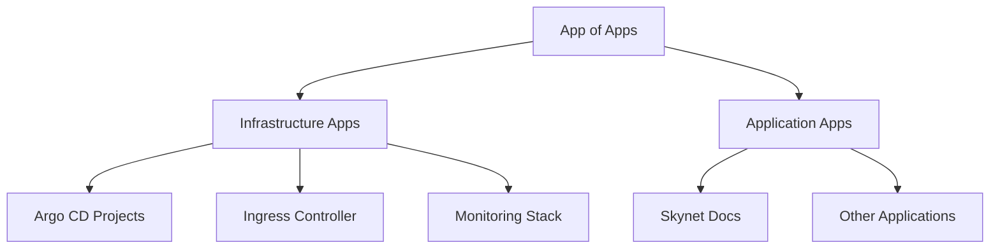

# Skynet Kubernetes Manifests

Central GitOps repository implementing the "App of Apps" pattern for managing all Kubernetes applications and infrastructure components via Argo CD.

## 🏗️ Repository Structure

```
skynet-kubernetes-manifests/
├── apps/                           # Application definitions
│   ├── app-of-apps.yaml           # Root application managing all others
│   ├── infrastructure/            # Infrastructure applications
│   │   ├── argocd-projects.yaml   # Argo CD projects
│   │   ├── ingress-nginx.yaml     # Ingress controller
│   │   └── monitoring.yaml        # Monitoring stack (optional)
│   └── applications/              # User applications
│       └── skynet-docs.yaml       # Documentation site
├── projects/                      # Argo CD project definitions
│   ├── infrastructure.yaml       # Infrastructure project
│   └── applications.yaml         # Applications project
└── README.md
```

## 🔄 GitOps Workflow

### App of Apps Pattern

The **App of Apps** pattern is a GitOps best practice where:

1. **Root Application** (`app-of-apps.yaml`) manages all other applications
2. **Infrastructure Applications** manage cluster-wide components
3. **Application Applications** manage user-facing services
4. **Projects** provide multi-tenancy and RBAC

### Deployment Flow



## 🚀 Getting Started

### 1. Deploy App of Apps

Apply the root application to Argo CD:

```bash
kubectl apply -f apps/app-of-apps.yaml
```

### 2. Verify Deployment

Check that all applications are synced:

```bash
argocd app list
argocd app get app-of-apps
```

### 3. Access Applications

Once deployed, applications will be available according to their ingress configuration.

## 🔧 Adding New Applications

### 1. Create Application Manifest

Add a new file in `apps/applications/`:

```yaml
apiVersion: argoproj.io/v1alpha1
kind: Application
metadata:
  name: my-new-app
  namespace: argocd
spec:
  project: applications
  source:
    repoURL: https://github.com/cyberdine-skynet/my-new-app
    targetRevision: main
    path: k8s
  destination:
    server: https://kubernetes.default.svc
    namespace: my-new-app
  syncPolicy:
    automated:
      prune: true
      selfHeal: true
    syncOptions:
      - CreateNamespace=true
```

### 2. Commit and Push

```bash
git add apps/applications/my-new-app.yaml
git commit -m "feat: add my-new-app application"
git push origin main
```

The app of apps will automatically detect and deploy the new application.

## 🛡️ Security & RBAC

### Projects

Applications are organized into projects for:
- **Resource isolation**
- **RBAC policies**
- **Source repository restrictions**
- **Destination cluster/namespace restrictions**

### Best Practices

- Use separate projects for infrastructure vs applications
- Implement least-privilege RBAC
- Restrict source repositories per project
- Use namespace isolation

## 📊 Monitoring

Monitor GitOps health through:
- **Argo CD UI**: Visual application status
- **Prometheus Metrics**: GitOps-specific metrics
- **Grafana Dashboards**: Application health visualization
- **Git History**: Complete audit trail

## 🔄 Rollback Strategy

### Git-based Rollbacks
```bash
# Revert to previous commit
git revert <commit-hash>
git push origin main

# Or reset to specific commit
git reset --hard <commit-hash>
git push --force origin main
```

### Application-specific Rollbacks
```bash
# Via Argo CD CLI
argocd app rollback <app-name> <revision-id>

# Via Argo CD UI
# Navigate to application → History → Rollback
```

## 🚨 Emergency Procedures

### Disable Automation
```bash
# Disable auto-sync for all apps
argocd app set app-of-apps --sync-policy=none

# Re-enable when ready
argocd app set app-of-apps --sync-policy=automated
```

### Manual Sync
```bash
# Force sync specific application
argocd app sync <app-name> --force

# Sync with server-side apply
argocd app sync <app-name> --server-side
```

---

⚡ **GitOps Powered** - All changes to this repository automatically deploy to the cluster via Argo CD
